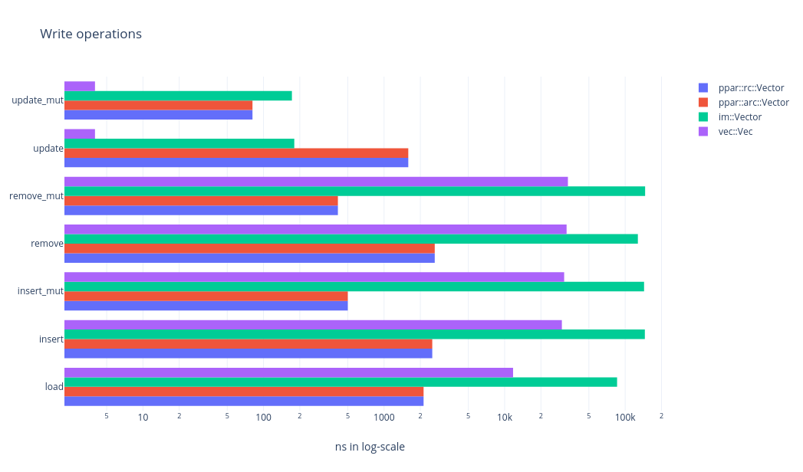

Package implement persistent array using a variant of rope data structure.

Why would you want it ?
-----------------------

Array is implemented as [std::vec][std_vec] in rust-standard library.
For most cases that should be fine. But when we start working with arrays
that are super-large and/or step into requirements like  non-destructive
writes and concurrent access, we find [std::vec][std_vec] insufficient.
[im][im] is a popular alternative, but has `insert()` and `delete()`
penalties similar to `std::vec` for large arrays. While most implementation
prefer to use [RRB-Tree][rrb], `ppar` is based on [Rope data structure][rope].

Here is a quick list of situation that might require using `ppar`.

* When array size is too large with repeated insert and remove operation.
* When shared ownership is required.
* When shared ownership across concurrent threads.
* To support undo/redo operation for array modifications.
* When splitting up of array and/or joining arrays are frequently done.
* Lazy clone of array using copy-on-write.

Algorithm
---------

Fundamentally, it can be viewed as a binary-tree of array-blocks, where
each leaf-node is a contiguous-block of type `T` items, while intermediate
nodes only hold references to the child nodes - `left` and `right`.
To be more precise, intermediate nodes in the tree are organised similar
to rope structure, as a tuple of `(weight, left, right)` where weight is
the sum of all items present in the leaf-nodes under the left-branch.

A list of alternatives can be found [here][alternate-solutions]. If you
find good alternatives please add it to the list and raise a PR.

If you are planning to use `ppar` for your project, do let us know.

Goals
-----

- [x] Vector parametrized over type T.
- [x] Immutable / Persistent collection of Vector<T>.
- [x] CRUD operation, get(), set(), delete(), insert(), all are persistent.
- [x] Convert from Vec<T> to ppar::Vector<T>.
- [x] Convert from ppar::Vector<T> to Vec<T>.
- [x] Thread safe operations.
- [x] [std::vec::Vec][std_vector] like mutable API.
- [ ] Iteration over collection, item-wise, chunk-wise, reverse.
- [ ] Deduplication.
- [ ] Membership.
- [x] Joining collections, splitting into collections.
- [ ] Partial collection.
- [ ] Extending collection.
- [ ] Queue operations, like pop(), push().
- [ ] Functional ops, like filter, map, reduce.
- [ ] Sort and search operations.
- [ ] Trait implementations.
  - [x] Clone
  - [ ] Eq, PartialEq, Ord, PartialOrd
  - [ ] Extend
  - [ ] From, FromIterator, IntoIterator
  - [ ] Hash
  - [ ] Index, IndexMut
  - [ ] Write
- [ ] Parallel iteration with [rayon][rayon].
- [x] Fuzzy tested.

The basic algorithm is fairly tight. Contributions are welcome to make the
`ppar::Vector` type as rich as [std::vec::Vec][std_vector] and
[im::Vector][im_vector].

Contributions
-------------

* Simple workflow. Fork, modify and raise a pull request.
* Before making a PR,
  * execute `check.sh` to pass unit-testing and fuzzy testing.
  * execute `perf.sh` for performance report.
* [Developer certificate of origin][dco] is preferred.

Benchmark
---------

On a 2008 core2-duo machine with 8GB RAM.

Alternate solutions
-------------------

* [im][im]
* [rpds][rpds]

[im]: https://github.com/bodil/im-rs
[im_vector]: https://docs.rs/im/15.0.0/im/struct.Vector.html
[rope]: https://en.wikipedia.org/wiki/Rope_(data_structure)
[rpds]: https://github.com/orium/rpds
[std_vec]: https://doc.rust-lang.org/beta/std/vec/index.html
[std_vector]: https://doc.rust-lang.org/beta/std/vec/struct.Vec.html
[rrb]: https://infoscience.epfl.ch/record/213452/files/rrbvector.pdf
[rayon]: https://crates.io/crates/rayon
[quickcheck]: https://crates.io/crates/quickcheck
[dco]: https://developercertificate.org/
